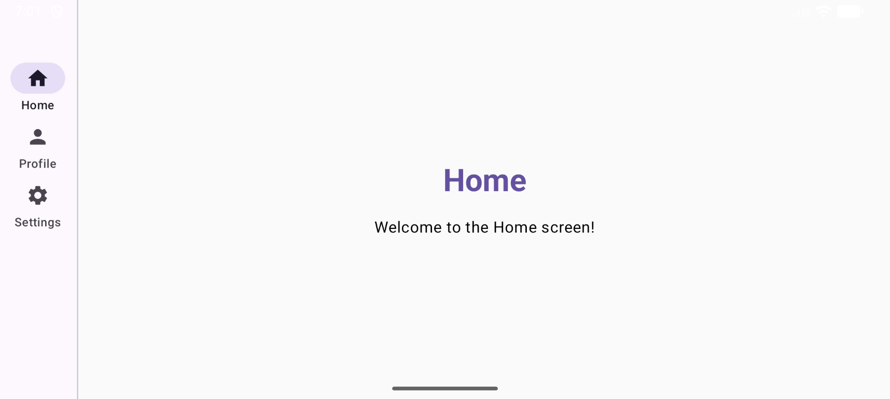

# Assignment 3 - Q4: Responsive Layout

## Project Overview
This application demonstrates a responsive UI that adapts its layout based on the screen width using `BoxWithConstraints`. 

## Key Features
- **Adaptive Navigation**: Uses a `NavigationBar` (Bottom Bar) for narrow phone screens and switches to a `NavigationRail` (Side Bar) for tablet/landscape modes (breakpoint: 600dp).
- **Material 3 Design**: Implementation of `Scaffold`, `NavigationRail`, `NavigationBar`, `Divider`, and M3 Typography.
- **Efficient Layouts**: Utilizes `Row`, `Column`, and `Box` with `Modifier.weight()` for adaptive spacing.

## Screenshots
| Phone Mode (Narrow) | Tablet/Landscape Mode (Wide) |
|---|---|
|  |  |

## AI Disclosure
- **AI Tool Used**: Google Gemini
- **Usage**: Assisted in resolving specific Kotlin compiler errors related to `BoxWithConstraints` scope and generic type inference in older Material 3 versions. Guided the structural implementation of the responsive logic.
